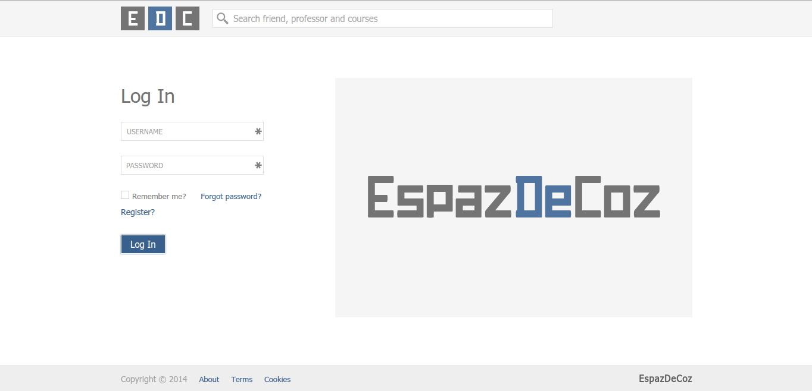
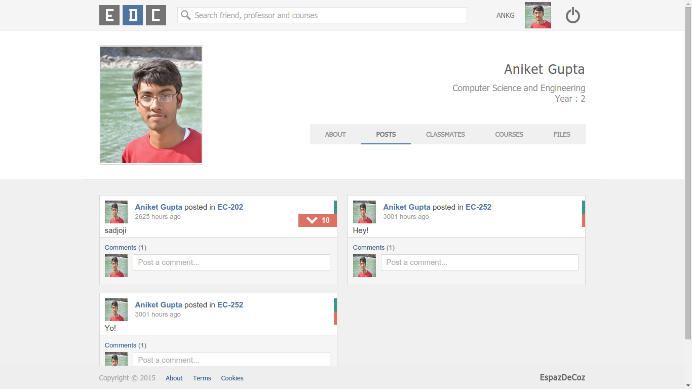

#EspazDeCoz

A Web Based Application name EspazDeCoz made by a team of four.
It is an interaction platform for both the students and professors, to discuss about courses that concern them as well as the one's they want to learn.

##Setup:
1. Get a copy of `composer.phar` by running on the terminal `curl -s https://getcomposer.org/installer | php`.
2. Create a `composer.json` file and add to that the lines
`{
    "require": {
        "torophp/torophp": "dev-master"
    }
}`
3. Run the command `php composer.phar install` . Installs the dependencies.
4. Fill in `config/config.json` with the corresponding values on your system.
5. If on Ubuntu:-
	* make a vhosts file in `sites-available` with the name course.localhost
	* run `a2ensite course.localhost` to configure your vhost
	* Add an entry that maps `127.0.0.1` to course.locahost(if needed)

Some Screenshots attached:-
###Home Page:- 
  

###Posts Page:- 
  

###About Page:- 
  

